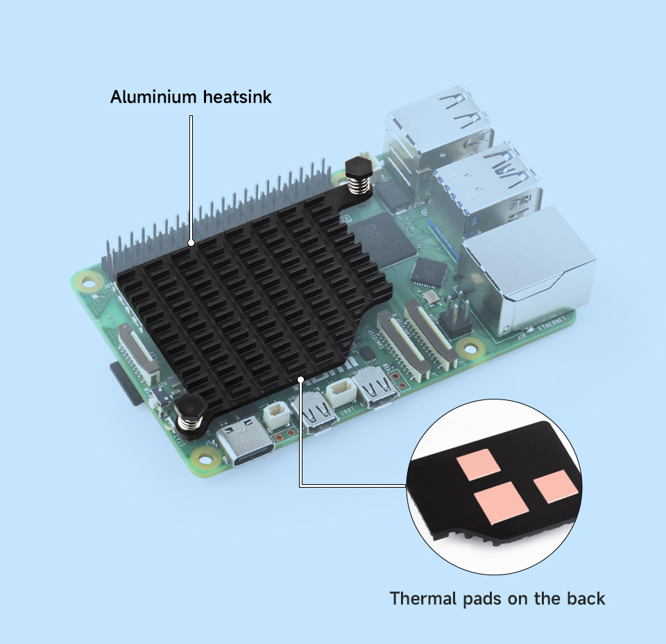
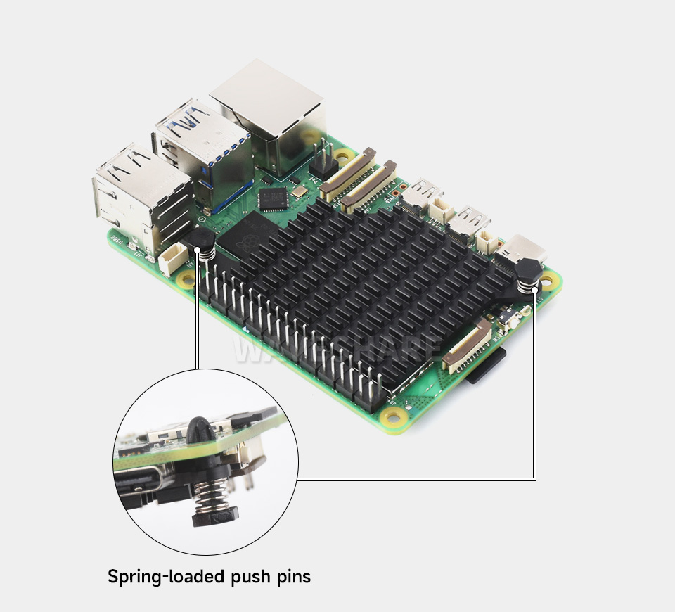
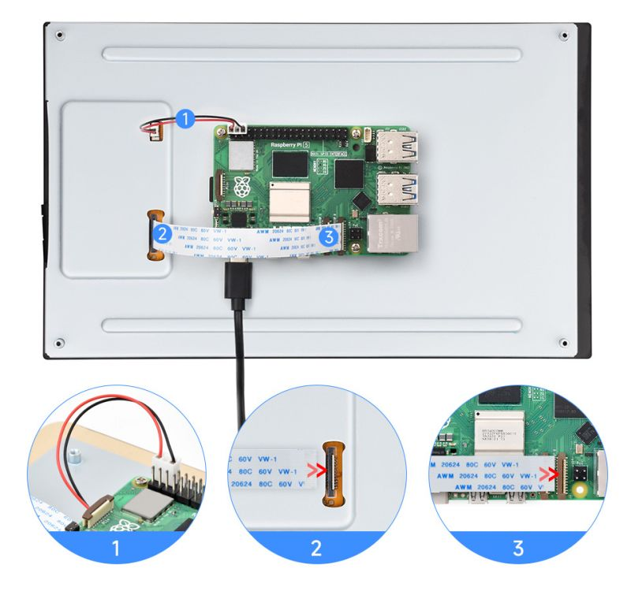
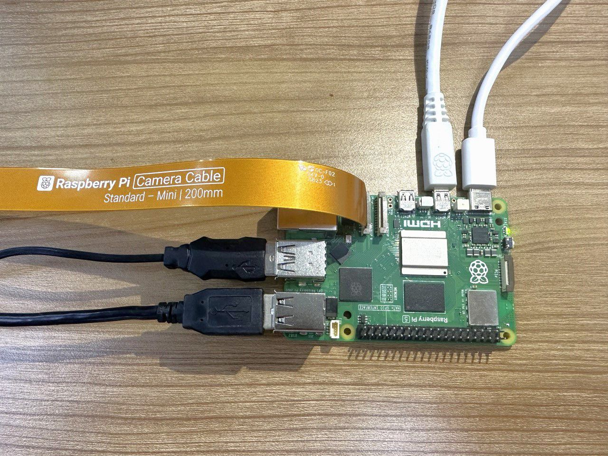
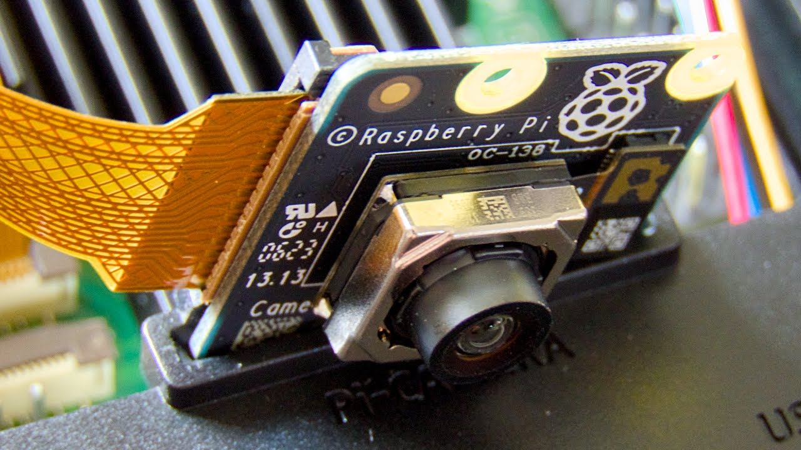
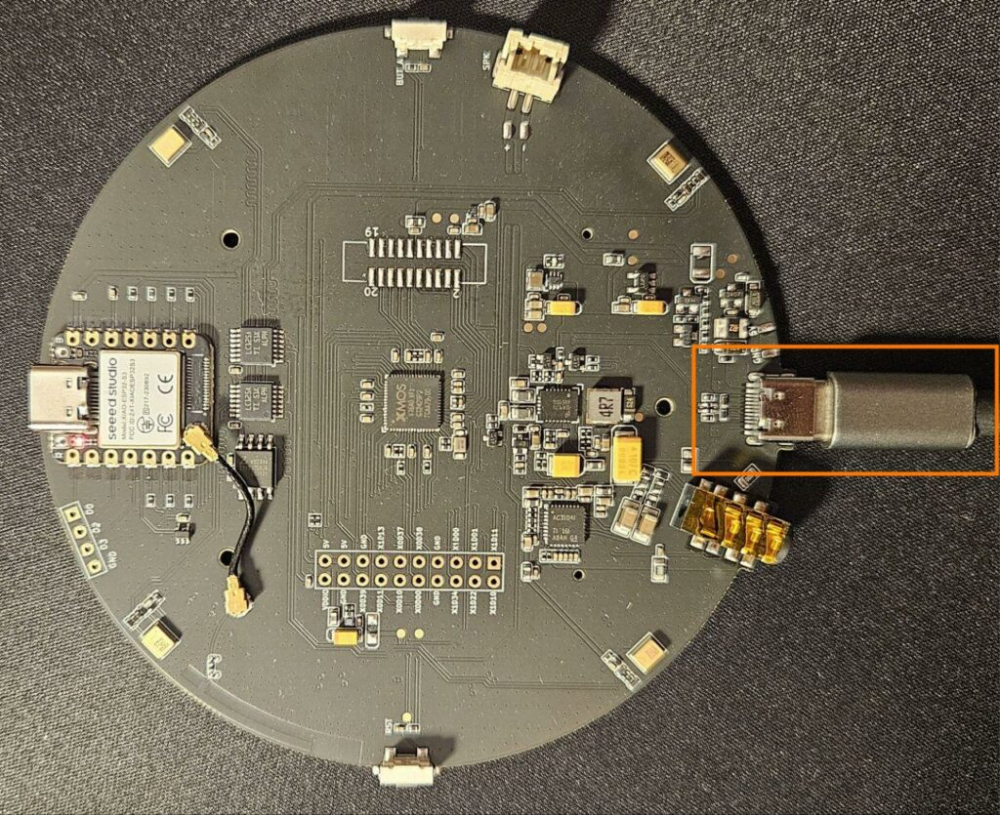
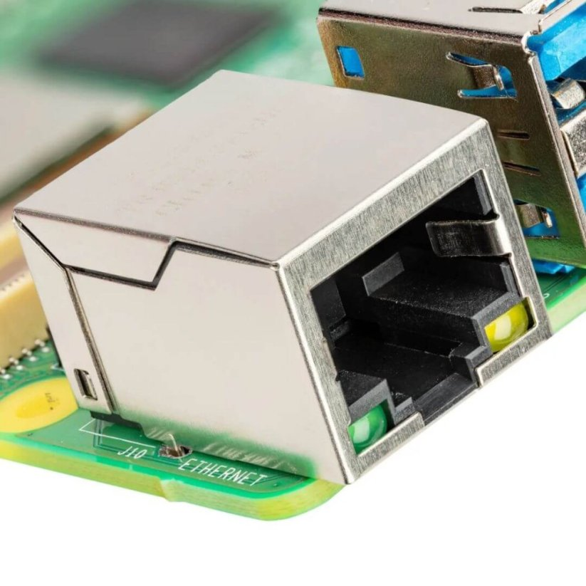
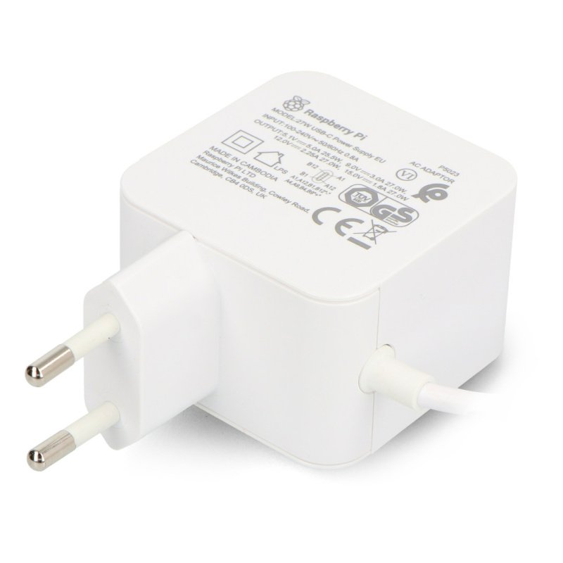
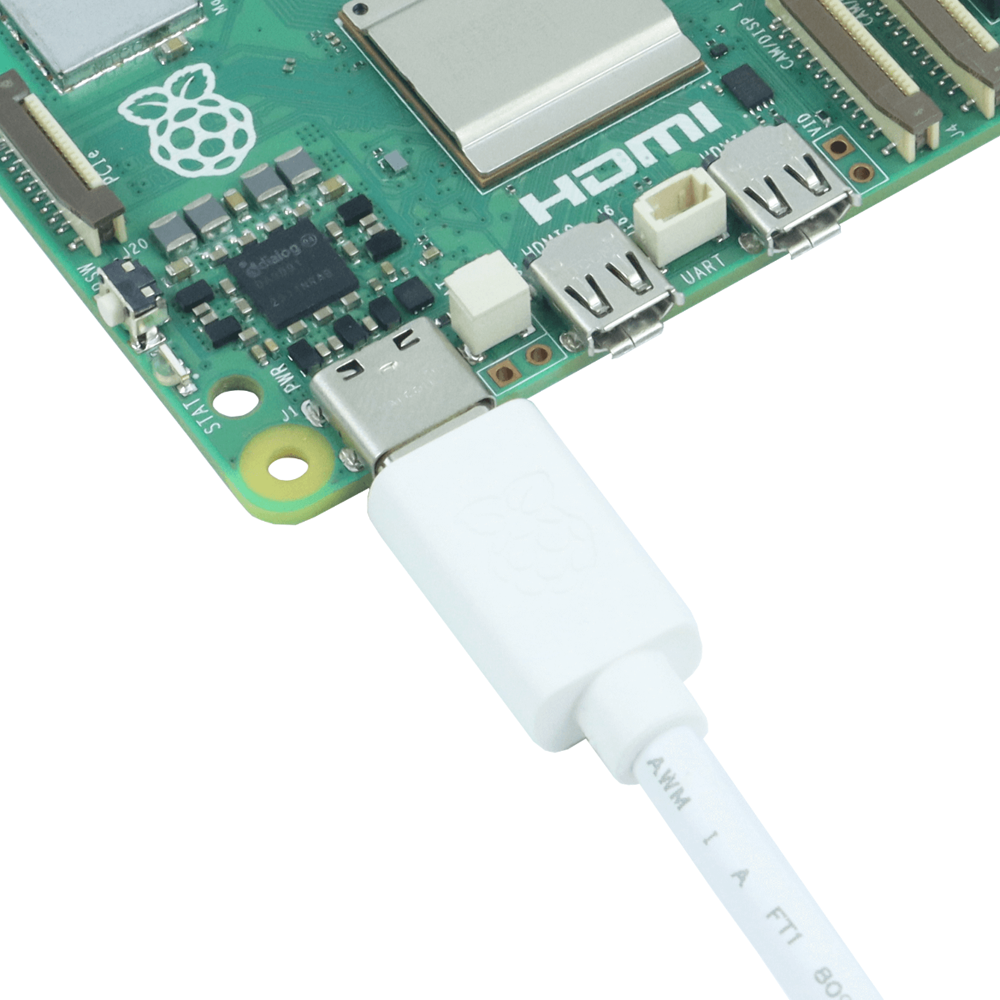

# FrameLink Hardware Build Guide

Step-by-step instructions for physically assembling a FrameLink unit. **This document only contains steps that have been validated on real hardware.**

---

## Assembly

1. **Attach the heatsink** to the Pi 5 with thermal pads and the spring-loaded push pins. Align the thermal pads over the SoC, PMIC, and wireless module, then press the heatsink onto the board until both push pins click into place. See the [Waveshare Pi5-Active-Cooler-C product page](https://www.waveshare.com/pi5-active-cooler-c.htm).

   

   

2. **Connect the 10.1" DSI touch display.** The display needs *two* connections to the Pi — a DSI ribbon cable for video/touch, and a separate 5V power connection. Connect the DSI ribbon cable between the display's DSI port and the Pi 5's DSI/camera port **closest to the heatsink**, then connect the 5V power cable from the display to the Pi 5's 5V GPIO pins. Without the 5V power connection, the display will stay black even with the DSI cable attached. See the official wiring diagram on the [Waveshare 10.1-DSI-TOUCH-A wiki](https://www.waveshare.com/wiki/10.1-DSI-TOUCH-A).

   > **Peel the protective film off the screen before powering on.** Leaving the shipping film in place blocks the capacitive touch layer (touch will not work) and, once the display warms up, the plastic can bond to the glass and become very hard to remove.

   

3. **Connect the Camera Module 3** via its ribbon cable. Attach one end of the ribbon cable to the camera module's connector (release the latch, insert the cable with the contacts facing the correct side, then close the latch), and attach the other end to the Pi 5's DSI/camera port **closest to the LAN jack**. The Pi 5 uses the narrower CSI connector, so use the cable that shipped with the camera (or a Pi 5-compatible adapter cable). See the [Raspberry Pi Camera documentation](https://www.raspberrypi.com/documentation/accessories/camera.html).

   

   

4. **Connect the ReSpeaker XVF3800** to one of the Pi 5's USB ports via USB-C-to-USB-A cable. See the [Seeed Studio ReSpeaker XVF3800 wiki](https://wiki.seeedstudio.com/respeaker_xvf3800_introduction/).

   

5. **Connect the speaker to the XVF3800.** The Adafruit 3351 speaker connects to the XVF3800's speaker output header using the JST PH 2-pin cable. See the [Seeed Studio ReSpeaker XVF3800 wiki](https://wiki.seeedstudio.com/respeaker_xvf3800_introduction/).

   

6. **Connect the LAN cable.** Plug an Ethernet cable into the Pi 5's Gigabit RJ45 jack and the other end into your router or switch. WiFi is also supported (configured during SD-card flashing), but a wired LAN connection is preferred for the FrameLink: it's more reliable, lower-latency, and removes WiFi congestion as a failure mode for the video call.

   

7. **Connect the 27W USB-C power supply** to the Pi's USB-C power input. Keep the power supply **unplugged from the wall** while connecting — the Pi should not be powered on yet. See the [Raspberry Pi getting-started documentation](https://www.raspberrypi.com/documentation/computers/getting-started.html).

   

   
