# Software Build Guide 02 — SD Card Flashing & First Boot

Flash Raspberry Pi OS Lite (Trixie, 64-bit) onto the microSD card from your workstation, insert it into the assembled Pi, boot, reach a working SSH session, and bring the system fully up to date.

---

## Steps

1. **Download and install Raspberry Pi Imager** on your workstation from the [official download page](https://www.raspberrypi.com/software/). Run the installer and accept the defaults.

2. **Insert the microSD card** into your workstation via a USB card reader.

3. **Start Raspberry Pi Imager.**

4. **Choose Device** → select **Raspberry Pi 5**.

   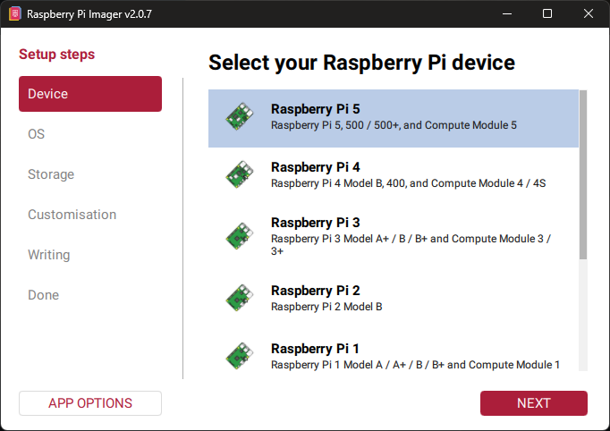

5. **Choose OS** → open the **Raspberry Pi OS (other)** section (not the default desktop section at the top of the list).

   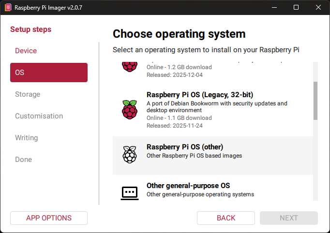

6. Inside that section, select **Raspberry Pi OS Lite (64-bit)** — a port of Debian Trixie, no desktop environment.

   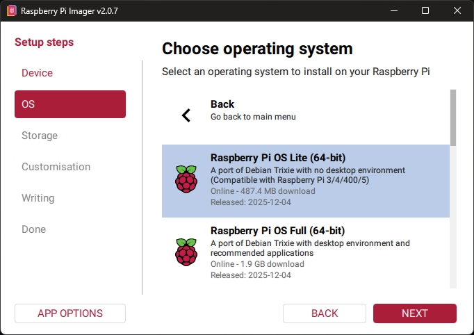

7. **Choose Storage** → select the microSD card as detected on your computer. Double-check the device name and capacity before continuing — the wrong pick will erase the wrong drive.

   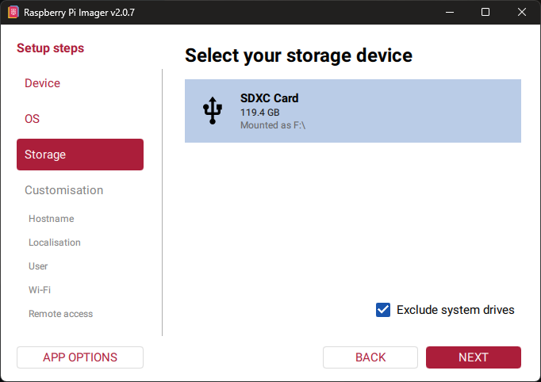

8. When prompted to apply OS customisation, choose **Edit Settings** and start with the **General** tab. **Set the hostname** to something that identifies this specific unit. Any valid hostname works — the rest of the guides just use whatever you pick here. A good pattern is `framelink-<recipient-name>` so that when you are configuring or troubleshooting a unit you immediately know *whose* frame you are looking at. In this guide the running example will be `framelink-douwe`, named after the intended recipient of the first built unit.

   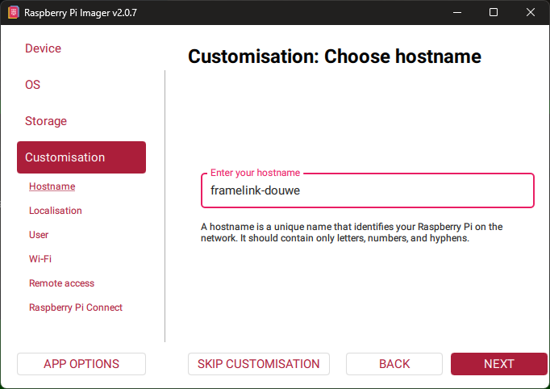

9. Still on the **General** tab, configure **localisation**: set the city/time zone and the keyboard layout.

   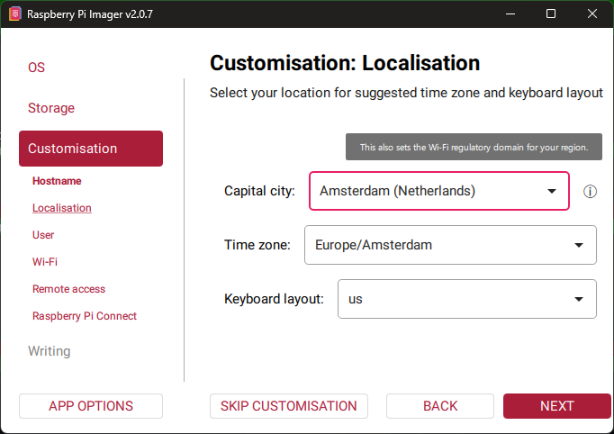

10. Set the **username** to `framelink`. Generate a **long, secure, random password** and store it in your password manager — you will not be logging in at the console day-to-day, so there is no reason to pick something memorable. Favour length and randomness over something you can type from memory.

    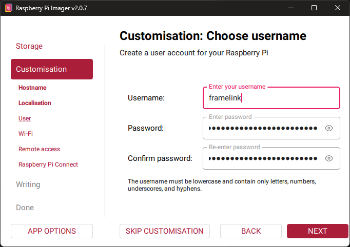

11. Optionally pre-configure **WiFi** by entering the SSID and password of the network where the FrameLink will live. For reliability, a wired LAN connection is recommended over WiFi when the location allows it.

    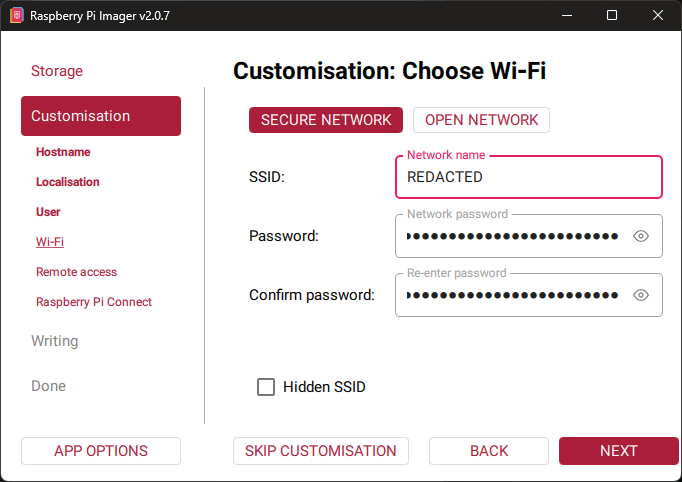

12. On the **Services** tab, enable **SSH** — this is required to configure the FrameLink remotely. Use **password authentication**. Public-key authentication is more secure but is out of scope for this guide.

    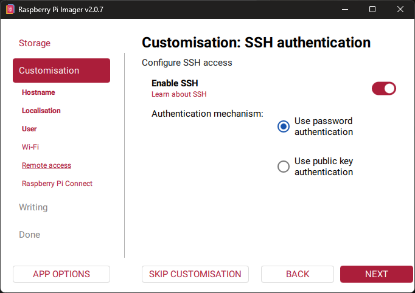

13. Optionally enable **Raspberry Pi Connect**. Raspberry Pi Connect is an official hosted service that lets you reach the Pi remotely (screen sharing + shell) without port-forwarding or a VPN — very useful once units are deployed in someone else's household. Before enabling it here, you first need to create a (free) Raspberry Pi ID account at [id.raspberrypi.com](https://id.raspberrypi.com/) — the Pi links to that central account at first boot, and you will see the unit appear in your device list at [connect.raspberrypi.com/devices](https://connect.raspberrypi.com/devices). See the [Raspberry Pi Connect documentation](https://www.raspberrypi.com/documentation/services/connect.html) for details. If enabled correctly, an authentication token is shown here; it has been redacted from the screenshot below.

    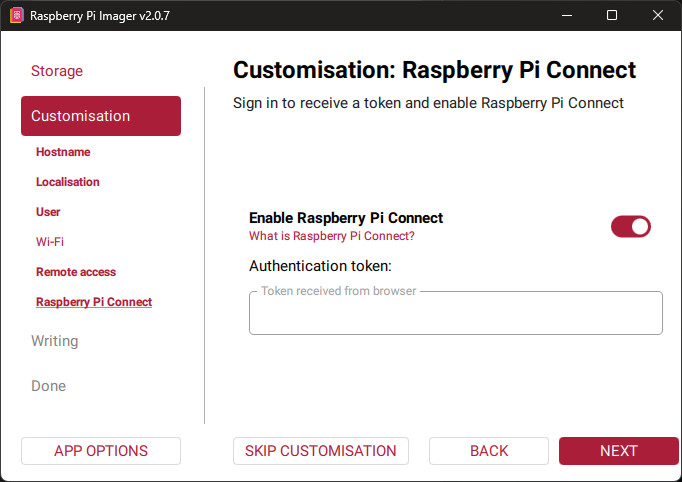

14. Review the **summary** of your customisation settings before writing.

    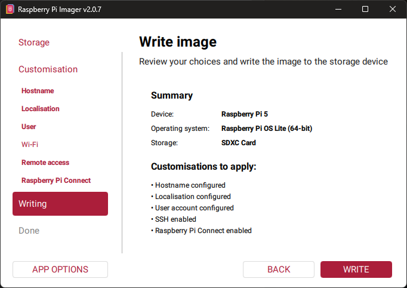

15. Confirm the **erase warning**. All data on the card will be wiped — proceed only when sure you selected the correct card in step 7.

    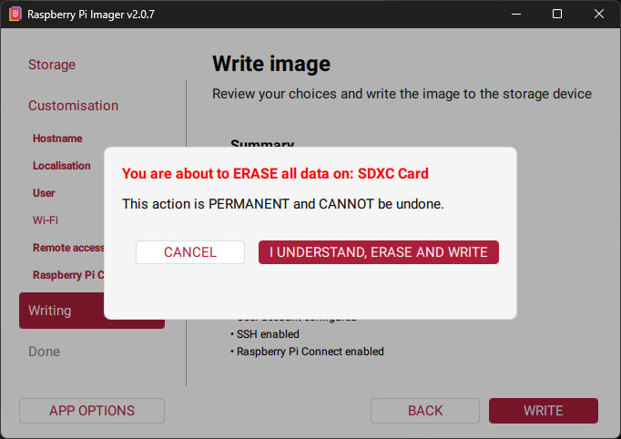

16. Wait for the write and verification to finish. The success dialog below is what you should see.

    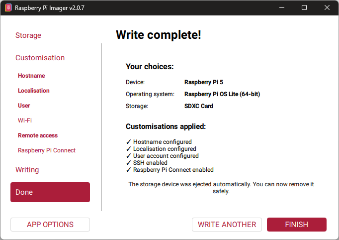

17. Eject the card from your workstation and **insert it into the Pi's microSD slot**.

    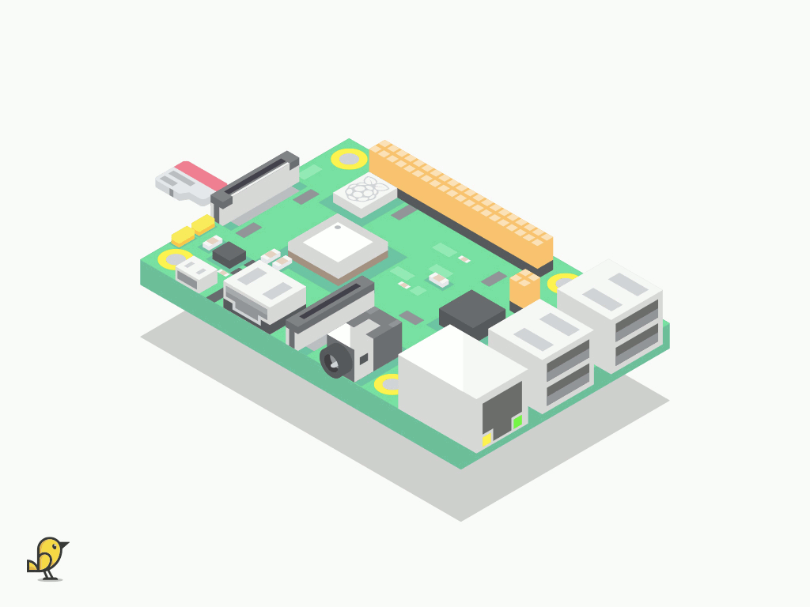

18. **Power the Pi on** by plugging the USB-C power supply (connected during hardware assembly) into a wall socket. Wait ~60 seconds for the first boot — the OS expands the filesystem, connects to the LAN or WiFi, and registers its mDNS hostname.

    > **The DSI display will stay dark at this stage — that is expected.** A stock Raspberry Pi OS Lite install does not enable the Waveshare panel until its overlay is added; that happens in [guide 3 (hardware configuration)](3-hardware-configuration.md). The ReSpeaker XVF3800 mic array may meanwhile show some LEDs flickering or sparkling in no particular pattern — that is just its power-on self-test, also expected and harmless. All verification at this stage happens over SSH, not via the Pi's own screen.

19. **Connect over SSH** from your workstation. Your workstation must be on the **same local network** as the Pi — `.local` hostname resolution (mDNS) only works within one broadcast domain. (Once the unit is deployed in another household, use Raspberry Pi Connect instead — see step 13.)

    > **New to SSH?** SSH ("Secure Shell") is an encrypted remote-login protocol: it gives you a text-based control session on the Pi from your own computer, exactly as if you were sitting in front of it with a keyboard. The Pi has no keyboard of its own, so SSH is how we will configure it from here on. Everything you type goes into a *command line* — a text prompt where you enter commands one line at a time and press Enter to run them. This guide uses that prompt throughout.
    >
    > **On macOS or Linux**, SSH is built in — open the Terminal app and run the command below.
    >
    > **On Windows 10 or 11**, SSH is also built in — open **Windows Terminal** (or the classic Command Prompt / PowerShell) and run the command below. If you prefer a graphical SSH client with saved sessions and a friendly GUI, install **PuTTY** from the [official PuTTY site](https://www.chiark.greenend.org.uk/~sgtatham/putty/). In PuTTY, set the host to `framelink-douwe.local`, port `22`, click *Open*, and log in as `framelink` with the password you set during flashing.
    >
    > **PuTTY tip:** inside the PuTTY console window, **right-click is paste**. Copy your long password from your password manager, click into the PuTTY window, right-click once, and press Enter — much easier than typing it. Note that nothing shows on screen as you "type" or paste a password; that is normal Linux behaviour, not a broken keyboard.

    The first time you connect, SSH will not recognise the Pi and will ask you to verify its host key. This is expected on every fresh device — there is no "known host" entry yet, so SSH is protecting you from silently trusting an unknown server. Type `yes` to accept, then enter the password you set during flashing. Subsequent connections will skip this prompt.

    

    ```bash
    ssh framelink@framelink-douwe.local
    ```

    

    ```text
    The authenticity of host 'framelink-douwe.local (fe80::xxxx:xxxx:xxxx:xxxx%N)' can't be established.
    ED25519 key fingerprint is SHA256:xxxxxxxxxxxxxxxxxxxxxxxxxxxxxxxxxxxxxxxxxxx.
    This key is not known by any other names.
    Are you sure you want to continue connecting (yes/no/[fingerprint])? yes
    Warning: Permanently added 'framelink-douwe.local' (ED25519) to the list of known hosts.
    framelink@framelink-douwe.local's password:
    Linux framelink-douwe 6.12.47+rpt-rpi-2712 #1 SMP PREEMPT Debian 1:6.12.47-1+rpt1 (2025-09-16) aarch64

    The programs included with the Debian GNU/Linux system are free software;
    the exact distribution terms for each program are described in the
    individual files in /usr/share/doc/*/copyright.

    Debian GNU/Linux comes with ABSOLUTELY NO WARRANTY, to the extent
    permitted by applicable law.
    framelink@framelink-douwe:~ $
    ```

    The password you type will not be echoed back — no asterisks, no dots, nothing. That is normal. The kernel version shown in the banner (`6.12.47+rpt-rpi-2712` here) reflects whatever kernel was baked into the OS image at the moment you flashed the card; the next step will update it.

20. **Bring the system fully up to date.** This pulls current security and feature updates for everything already installed. Expect a long transcript and a runtime of several minutes on the first run after flashing a new SD card.

    

    ```bash
    sudo apt update && sudo apt full-upgrade -y
    ```

    

    ```text
    Get:1 http://deb.debian.org/debian trixie InRelease [140 kB]
    Get:2 http://deb.debian.org/debian trixie-updates InRelease [47.3 kB]
    Get:3 http://deb.debian.org/debian-security trixie-security InRelease [43.4 kB]
    Get:4 http://archive.raspberrypi.com/debian trixie InRelease [54.9 kB]
    Get:5 http://deb.debian.org/debian trixie/main arm64 Packages [9,607 kB]
    ...
    Get:14 http://deb.debian.org/debian-security trixie-security/main Translation-en [77.0 kB]
    Fetched 26.6 MB in 3s (9,530 kB/s)
    Reading package lists...
    Building dependency tree...
    Reading state information...
    92 packages can be upgraded. Run 'apt list --upgradable' to see them.

    WARNING: apt does not have a stable CLI interface. Use with caution in scripts.

    Reading package lists...
    Building dependency tree...
    Reading state information...
    Calculating upgrade...
    The following package was automatically installed and is no longer required:
      retry
    Use 'sudo apt autoremove' to remove it.

    Upgrading:
      base-files          libcom-err2             openssh-server
      bash                libdpkg-perl            openssh-sftp-server
      busybox             libdrm-common           openssl
      ...
      libcap2             logsave                 wireless-regdb
      libcap2-bin         openssh-client

    Installing dependencies:
      awb-nn                    libx11-xcb1
      libabsl20240722           libxcb-dri3-0
      ...
      linux-kbuild-6.12.75+rpt
      mesa-libgallium
      libwayland-server0

    Suggested packages:
      lm-sensors  firmware-linux-free  linux-doc-6.12  debian-kernel-handbook

    REMOVING:
      libcamera0.6

    Summary:
      Upgrading: 92, Installing: 33, Removing: 1, Not Upgrading: 0
      Download size: 289 MB
      Space needed: 379 MB / 116 GB available

    Get:1 http://deb.debian.org/debian trixie/main arm64 base-files arm64 13.8+deb13u4 [73.2 kB]
    Get:2 http://archive.raspberrypi.com/debian trixie/main arm64 libc6-dev arm64 2.41-12+rpt1+deb13u2 [2,355 kB]
    ...
    Get:125 http://deb.debian.org/debian trixie/main arm64 wireless-regdb all 2026.02.04-1~deb13u1 [12.2 kB]
    apt-listchanges: Reading changelogs...
    Preconfiguring packages ...
    Fetched 289 MB in 6s (48.5 MB/s)
    (Reading database ... 65992 files and directories currently installed.)
    Preparing to unpack .../base-files_13.8+deb13u4_arm64.deb ...
    Unpacking base-files (13.8+deb13u4) over (13.8+deb13u2) ...
    Setting up base-files (13.8+deb13u4) ...
    Installing new version of config file /etc/debian_version ...
    ...
    Setting up raspi-utils (20260304+1-1) ...
    Setting up libcamera-ipa:arm64 (0.7.0+rpt20260205-1) ...
    Setting up rpicam-apps-core (1.11.1-1) ...
    Setting up rpi-eeprom (28.14-1) ...
    Setting up rpicam-apps-lite (1.11.1-1) ...
    Processing triggers for procps (2:4.0.4-9) ...
    Processing triggers for debianutils (5.23.2) ...
    Processing triggers for initramfs-tools (0.148.3+rpt2) ...
    update-initramfs: Generating /boot/initrd.img-6.12.75+rpt-rpi-v8
    '/boot/initrd.img-6.12.75+rpt-rpi-v8' -> '/boot/firmware/initramfs8'
    update-initramfs: Generating /boot/initrd.img-6.12.75+rpt-rpi-2712
    '/boot/initrd.img-6.12.75+rpt-rpi-2712' -> '/boot/firmware/initramfs_2712'
    Processing triggers for libc-bin (2.41-12+rpt1+deb13u2) ...
    Processing triggers for systemd (257.9-1~deb13u1) ...
    Processing triggers for man-db (2.13.1-1) ...
    ```

    The transcript is abridged with `...` — the real run prints every package fetch, unpack, and setup line individually and spans several hundred lines. Exact package counts and versions will differ from the capture above depending on when you flash. The run is complete when you see the `Processing triggers for man-db` line and the shell prompt returns.

21. **Reboot** so any new kernel, firmware, or libraries from the upgrade take effect. The `sudo reboot` command prints nothing on the remote side before the channel closes; the single line you see in your terminal is emitted by the ssh client on your workstation and varies by client. PuTTY closes its window and pops up a dialog instead of printing a line.

    

    ```bash
    sudo reboot
    ```

    

    ```text
    client_loop: send disconnect: Connection reset
    ```

    The exact wording above is what the built-in Windows / macOS / Linux OpenSSH client prints. PuTTY instead closes its session window and pops up a "Network error: Software caused connection abort" dialog. Either way the Pi is rebooting — wait before reconnecting.

22. **Reconnect over SSH** once the Pi has finished booting again. Wait ~30 seconds after the previous step before trying, otherwise you will hit a "connection refused" error. This time the host key is already trusted, so you skip straight to the password prompt and the login banner.

    

    ```bash
    ssh framelink@framelink-douwe.local
    ```

    

    ```text
    framelink@framelink-douwe.local's password:
    Linux framelink-douwe 6.12.75+rpt-rpi-2712 #1 SMP PREEMPT Debian 1:6.12.75-1+rpt1 (2026-03-11) aarch64

    The programs included with the Debian GNU/Linux system are free software;
    the exact distribution terms for each program are described in the
    individual files in /usr/share/doc/*/copyright.

    Debian GNU/Linux comes with ABSOLUTELY NO WARRANTY, to the extent
    permitted by applicable law.
    Last login: Sun Apr 12 17:39:42 2026 from fe80::xxxx:xxxx:xxxx:xxxx%eth0
    framelink@framelink-douwe:~ $
    ```

    Notice the kernel version in the banner has moved on from step 19 — it now reads `6.12.75+rpt-rpi-2712` (up from `6.12.47+rpt-rpi-2712`), confirming the upgrade-then-reboot cycle picked up the new kernel. The `Last login:` line shows the previous session — the one you used to run `sudo reboot`.

**Checkpoint:** you can reach the Pi over the network via `ssh framelink@<hostname>.local`, `apt full-upgrade` completes cleanly, and the Pi comes back up after the reboot. The DSI display is still dark (the Waveshare overlay is added in the next guide) and the ReSpeaker XVF3800 mic array shows some LEDs flickering without a real pattern — both are expected at this stage.
