# The reconcile DAG

<!--
  GENERATED FILE — do not edit by hand. Every node, edge, position and count below is
  read out of the catalog the agent actually runs.

  Regenerate:   dotnet run --project tools/FrameLink.Diagram -- write
  Check only:   dotnet run --project tools/FrameLink.Diagram -- check

  The suite re-renders this file on every run and fails if the committed copy differs,
  so a stale diagram is a red test rather than a picture people quietly stop trusting.
-->

§2.2's "explicit lightweight DAG", drawn from itself. `tools/FrameLink.Diagram` builds
the real catalog — the same `DeviceCatalog.Build` an agent builds at start-up — sorts it
through the same `ResourceGraph`, and renders this file from the result. Nothing here is
typed by hand, so nothing here can be out of date without a test going red.

The catalog holds **83 resources** in 25 areas, joined by 80 dependency edges.

Two hand-written companions sit beside this one and are not generated:
[every source of non-determinism, classified](reconcile-determinism.md), which says what can
and cannot make two runs differ; and [reconcile ordering and every bound in the
agent](reconcile-ordering-and-timeouts.md), which inventories every number the agent waits on.

---

## 1. How to read this

**An arrow means "has to be `InSync` first".** `A --> B` reads *A before B*: while A is
anything other than `InSync` this pass, B is recorded `Blocked(A)` and is neither observed
nor acted on, so it spends no attempt and takes no reboot. That is the only thing an edge
does, and it is the whole reason the graph exists — `Blocked(dependency)` is a derived
fact rather than a claim somebody maintained by hand.

**The walk is one sequential `foreach` over the order in §3.** No parallelism, no
re-sorting, no arrival-order tie-break: the sort runs once at construction, ties break on
declaration index, and the result is a `List`. Same build, same hardware, same route
through the graph, every pass and every boot.

**The catalog file *is* the execution order, verbatim.** The topological sort returned
the declaration order unchanged — on this catalog it is an identity function with a
validator attached. `AgentResourceGraphTests` asserts exactly that, so the day an edge
reorders something this sentence changes and a test goes red on the same commit.

**Areas are the resource id's first dot-separated segment** — `pkg`, `audio`, `kiosk`,
`unit`. A mechanical rule rather than an editorial one, because an editorial one is a
second thing to maintain and would be the part of a generated document that still drifts.
It has one real cost, stated rather than hidden: the session and kiosk stack is one
subject spread across `session`, `labwc`, `unit`, `portal` and `camera`, because that is
how its ids are spelled.

**Three views, because one picture of 83 nodes is a picture nobody opens twice.** §2 is the
area map — small enough to take in at a glance, and where the gates are. §3 is the
numbered running order, which is the plainest statement of what happens when. §4 is one
small diagram per area that waits on something. §5 is the whole graph in one picture, and
it is dense; it is last because it is the least useful of the three, not the most.

---

## 2. The area map

Areas, and which areas they wait on. An edge label is how many resource-level
dependencies it stands for; self-edges are left out because an area waiting on itself is
not a fact about the shape. An area with no arrow at either end holds only resources that
wait on nothing and that nothing waits on.

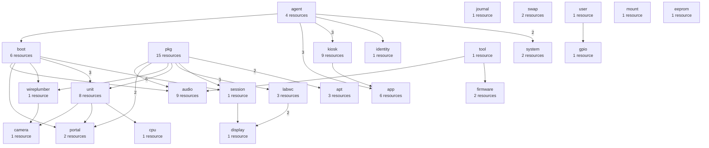

---

## 3. The execution order

Every resource, in the order one pass visits it. A pass changes at most one of them and
then reboots and verifies, so this is the order a bare frame converges in rather than a
list of things that happen at once. Dependencies are shown by position, sorted ascending,
which makes the property worth checking by eye visible: **every number after "waits for"
is smaller than the one it sits beside.**

1. `agent.version`
2. `boot.config.dtoverlay-waveshare-panel`
3. `boot.cmdline.fbcon-rotate` — waits for #2 `boot.config.dtoverlay-waveshare-panel`
4. `agent.keypair`
5. `journal.storage-persistent`
6. `agent.adoption`
7. `agent.device-name` — waits for #6 `agent.adoption`
8. `pkg.labwc`
9. `pkg.chromium`
10. `pkg.wireplumber`
11. `pkg.pipewire-alsa`
12. `pkg.wlr-randr`
13. `pkg.xdg-desktop-portal`
14. `pkg.xdg-desktop-portal-gtk`
15. `pkg.gstreamer1.0-tools`
16. `pkg.gstreamer1.0-plugins-base`
17. `pkg.gstreamer1.0-libcamera`
18. `pkg.gstreamer1.0-pipewire`
19. `pkg.libspa-0.2-libcamera.absent`
20. `pkg.dfu-util`
21. `pkg.grim`
22. `pkg.unattended-upgrades`
23. `system.timezone` — waits for #6 `agent.adoption`
24. `system.locale` — waits for #6 `agent.adoption`
25. `swap.zram-active`
26. `swap.no-file-backed` — waits for #25 `swap.zram-active`
27. `user.framelink.supplementary-groups`
28. `boot.autologin.getty-tty1`
29. `mount.tmp.tmpfs`
30. `apt.auto-upgrades-enabled` — waits for #22 `pkg.unattended-upgrades`
31. `apt.unattended-upgrades.allowed-origins` — waits for #22 `pkg.unattended-upgrades`
32. `apt.daily-timers.enabled-and-active`
33. `identity.hostname` — waits for #6 `agent.adoption`
34. `audio.modprobe.snd-usb-audio-index`
35. `unit.cpu-performance.content`
36. `unit.cpu-performance.enabled` — waits for #35 `unit.cpu-performance.content`
37. `cpu.governor.performance` — waits for #36 `unit.cpu-performance.enabled`
38. `session.bash-profile-exec-labwc` — waits for #8 `pkg.labwc`, #28 `boot.autologin.getty-tty1`
39. `labwc.autostart.content` — waits for #8 `pkg.labwc`, #12 `pkg.wlr-randr`
40. `labwc.autostart.executable` — waits for #39 `labwc.autostart.content`
41. `labwc.rc-xml.touch-map` — waits for #8 `pkg.labwc`
42. `display.dsi2-transform` — waits for #38 `session.bash-profile-exec-labwc`, #39 `labwc.autostart.content`, #40 `labwc.autostart.executable`
43. `unit.xdg-desktop-portal.dropin-desktop` — waits for #13 `pkg.xdg-desktop-portal`, #28 `boot.autologin.getty-tty1`
44. `app.http.local-origin`
45. `unit.chromium-kiosk.content` — waits for #9 `pkg.chromium`, #28 `boot.autologin.getty-tty1`
46. `unit.chromium-kiosk.enabled` — waits for #45 `unit.chromium-kiosk.content`
47. `unit.chromium-kiosk.running-matches-content` — waits for #45 `unit.chromium-kiosk.content`, #46 `unit.chromium-kiosk.enabled`
48. `wireplumber.conf.camera-monitors-disabled` — waits for #10 `pkg.wireplumber`, #28 `boot.autologin.getty-tty1`
49. `unit.framelink-camera.content` — waits for #15 `pkg.gstreamer1.0-tools`, #16 `pkg.gstreamer1.0-plugins-base`, #17 `pkg.gstreamer1.0-libcamera`, #18 `pkg.gstreamer1.0-pipewire`, #28 `boot.autologin.getty-tty1`
50. `unit.framelink-camera.enabled` — waits for #49 `unit.framelink-camera.content`
51. `portal.permission-store.camera` — waits for #14 `pkg.xdg-desktop-portal-gtk`, #28 `boot.autologin.getty-tty1`
52. `portal.camera-interface-published` — waits for #14 `pkg.xdg-desktop-portal-gtk`, #43 `unit.xdg-desktop-portal.dropin-desktop`
53. `camera.pipewire-node.framelink-cam` — waits for #48 `wireplumber.conf.camera-monitors-disabled`, #50 `unit.framelink-camera.enabled`
54. `kiosk.binary.pinned-release`
55. `kiosk.offline-cache.dir` — waits for #54 `kiosk.binary.pinned-release`
56. `kiosk.config.immich-url` — waits for #6 `agent.adoption`, #54 `kiosk.binary.pinned-release`
57. `kiosk.config.immich-api-key` — waits for #6 `agent.adoption`, #54 `kiosk.binary.pinned-release`
58. `kiosk.config.albums` — waits for #6 `agent.adoption`, #54 `kiosk.binary.pinned-release`
59. `kiosk.config.offline-mode-enabled` — waits for #54 `kiosk.binary.pinned-release`
60. `kiosk.config.offline-asset-count` — waits for #59 `kiosk.config.offline-mode-enabled`
61. `kiosk.listen-address` — waits for #54 `kiosk.binary.pinned-release`
62. `kiosk.process.supervised` — waits for #56 `kiosk.config.immich-url`, #57 `kiosk.config.immich-api-key`, #61 `kiosk.listen-address`
63. `app.config.identity` — waits for #6 `agent.adoption`
64. `app.config.room` — waits for #6 `agent.adoption`
65. `app.config.livekit-url` — waits for #6 `agent.adoption`
66. `app.config.livekit-token` — waits for #63 `app.config.identity`, #64 `app.config.room`, #65 `app.config.livekit-url`
67. `app.config.immich-kiosk-url` — waits for #61 `kiosk.listen-address`
68. `tool.xvf-host.installed`
69. `firmware.xvf3800.image`
70. `firmware.xvf3800.recognised` — waits for #68 `tool.xvf-host.installed`
71. `audio.xvf3800.gpo-x0d31-amp-enable` — waits for #68 `tool.xvf-host.installed`
72. `audio.mixer.pcm0-playback-switch` — waits for #34 `audio.modprobe.snd-usb-audio-index`
73. `audio.mixer.pcm1-playback-switch` — waits for #34 `audio.modprobe.snd-usb-audio-index`
74. `audio.wireplumber.playback-volume` — waits for #10 `pkg.wireplumber`, #28 `boot.autologin.getty-tty1`
75. `audio.mixer.pcm0-playback-volume` — waits for #34 `audio.modprobe.snd-usb-audio-index`, #72 `audio.mixer.pcm0-playback-switch`, #74 `audio.wireplumber.playback-volume`
76. `audio.mixer.pcm1-playback-volume` — waits for #34 `audio.modprobe.snd-usb-audio-index`, #73 `audio.mixer.pcm1-playback-switch`
77. `audio.mixer.headset-capture-volume` — waits for #34 `audio.modprobe.snd-usb-audio-index`
78. `audio.alsa.stored-state` — waits for #72 `audio.mixer.pcm0-playback-switch`, #73 `audio.mixer.pcm1-playback-switch`, #74 `audio.wireplumber.playback-volume`, #75 `audio.mixer.pcm0-playback-volume`, #76 `audio.mixer.pcm1-playback-volume`, #77 `audio.mixer.headset-capture-volume`
79. `gpio.button.line` — waits for #27 `user.framelink.supplementary-groups`
80. `boot.config.camera-auto-detect`
81. `boot.config.dtoverlay-vc4-kms-v3d-noaudio`
82. `boot.cmdline.wifi-regdom` — waits for #6 `agent.adoption`
83. `eeprom.config`

---

## 4. Area detail

One diagram per area that waits on something, showing that area's own resources and
whatever they wait on. Nodes carry their position from §3. A **rounded** node belongs to
another area and is drawn here only because something in this one names it.

### `agent` — 4 resources, walked between #1 and #7

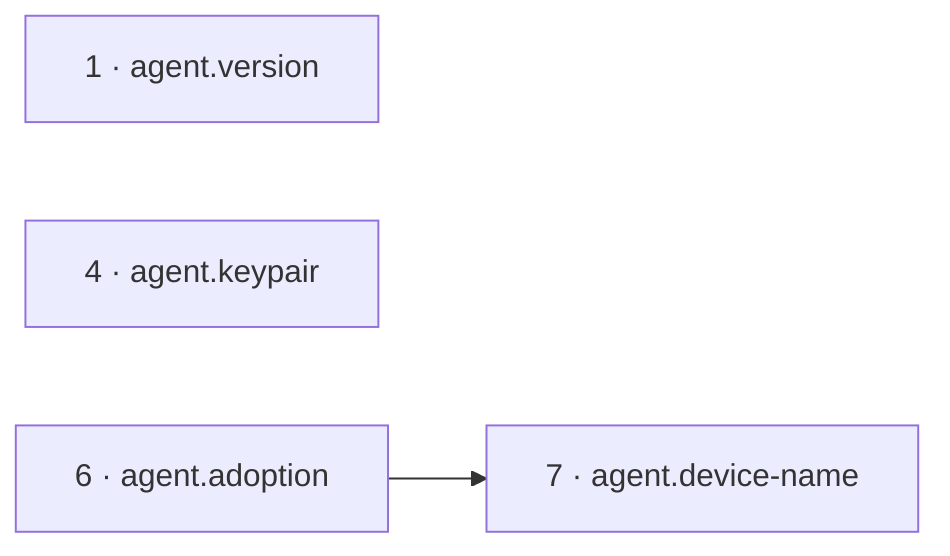

### `boot` — 6 resources, walked between #2 and #82

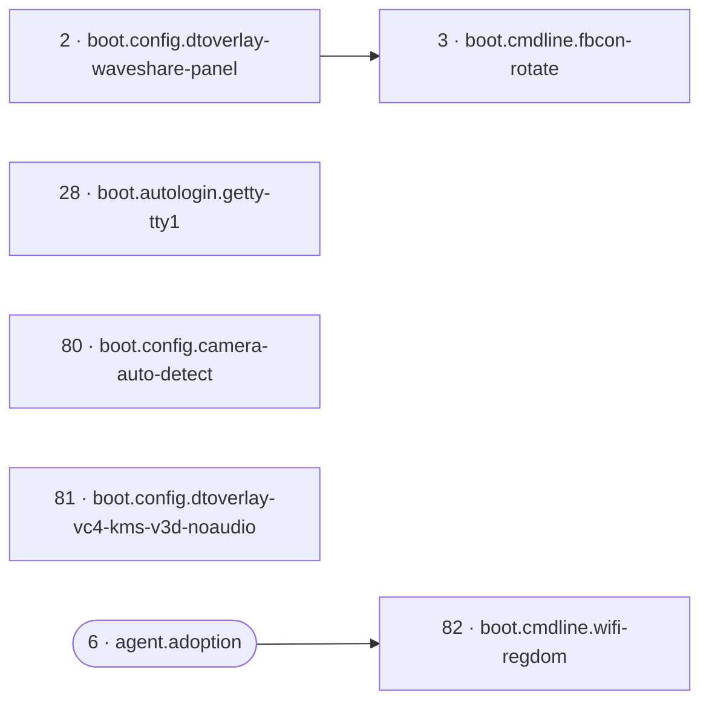

### `system` — 2 resources, walked between #23 and #24

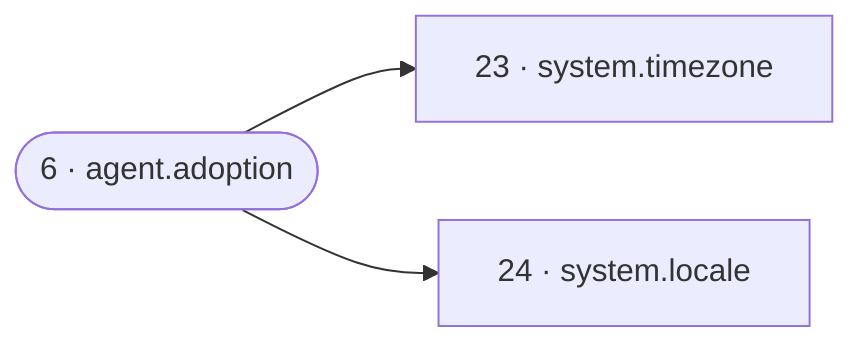

### `swap` — 2 resources, walked between #25 and #26


### `apt` — 3 resources, walked between #30 and #32

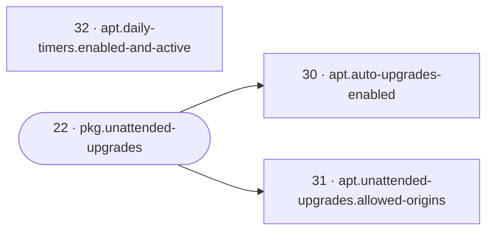

### `identity` — 1 resource, walked at #33


### `audio` — 9 resources, walked between #34 and #78

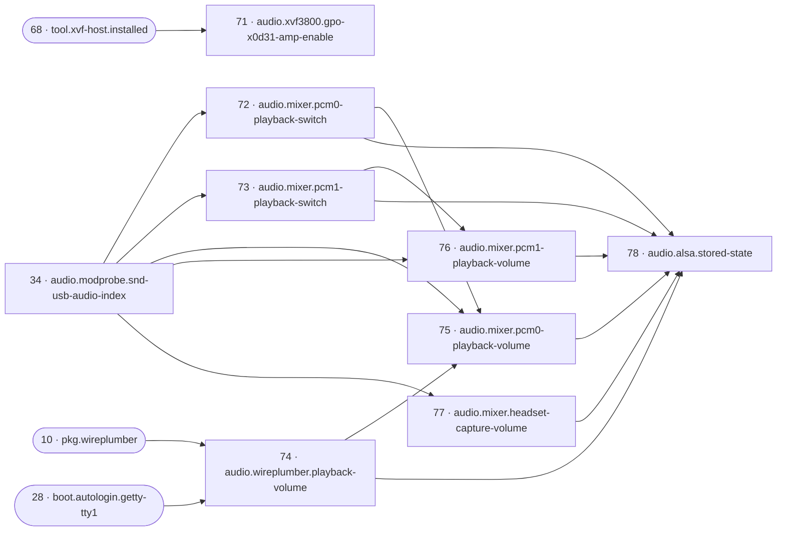

### `unit` — 8 resources, walked between #35 and #50

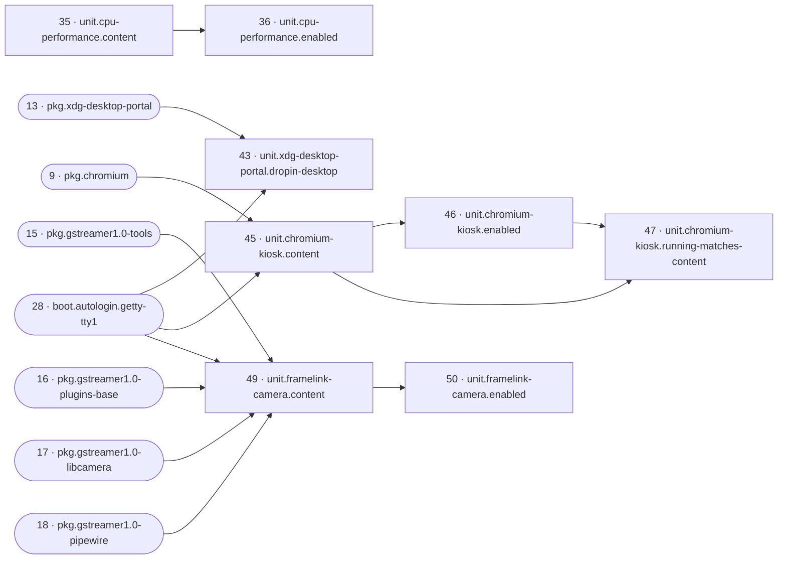

### `cpu` — 1 resource, walked at #37

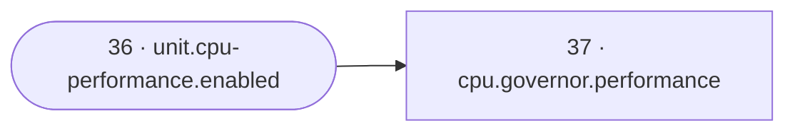

### `session` — 1 resource, walked at #38

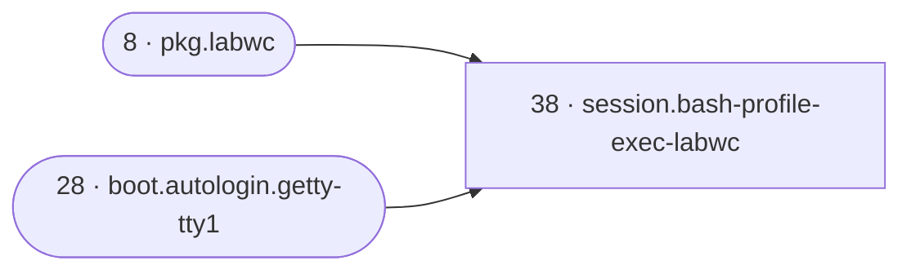

### `labwc` — 3 resources, walked between #39 and #41

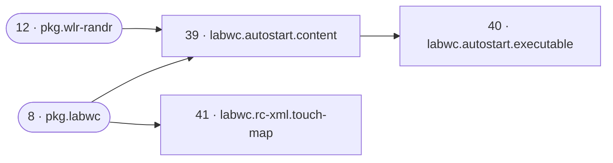

### `display` — 1 resource, walked at #42

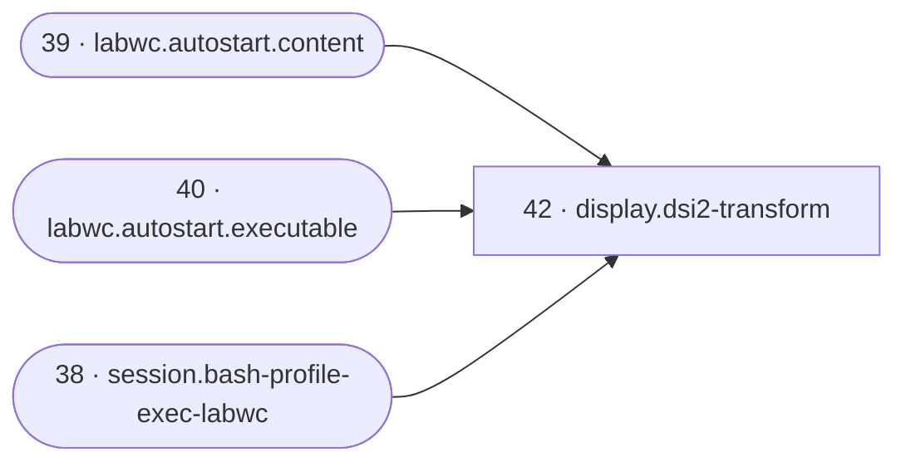

### `app` — 6 resources, walked between #44 and #67

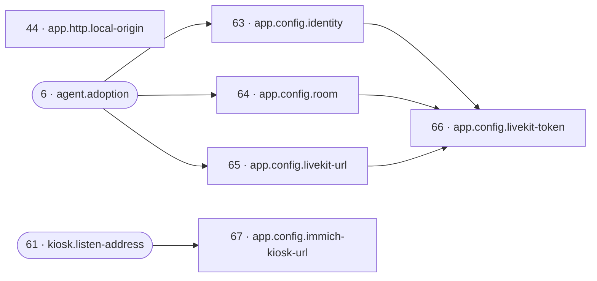

### `wireplumber` — 1 resource, walked at #48

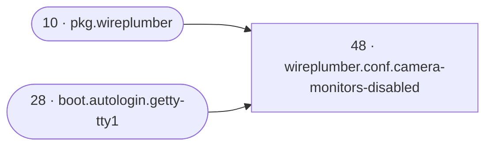

### `portal` — 2 resources, walked between #51 and #52

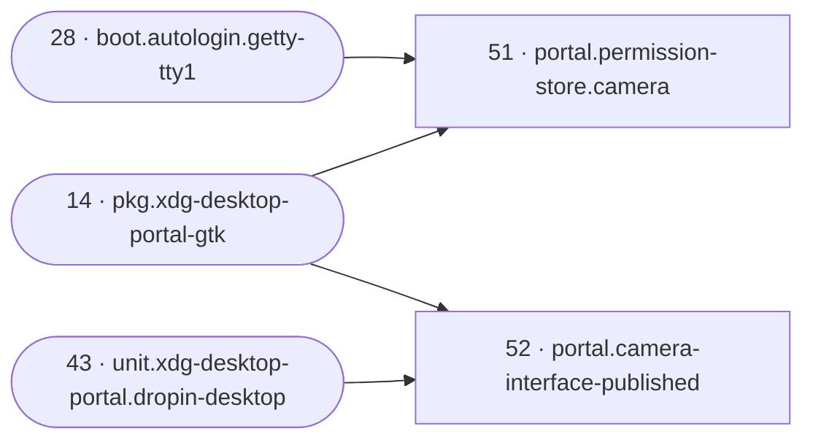

### `camera` — 1 resource, walked at #53


### `kiosk` — 9 resources, walked between #54 and #62

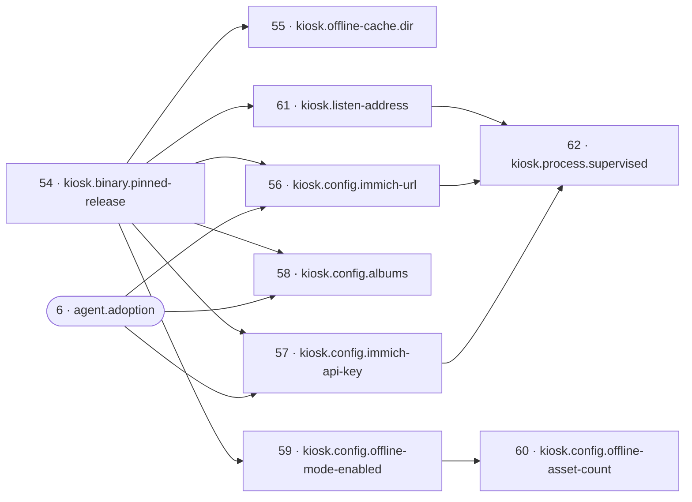

### `firmware` — 2 resources, walked between #69 and #70

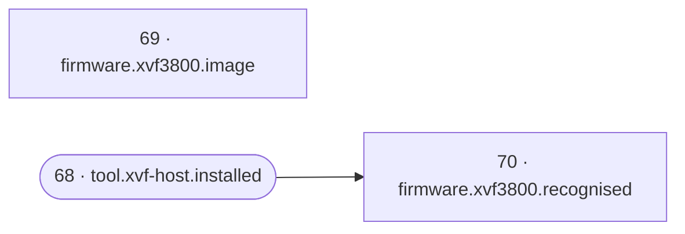

### `gpio` — 1 resource, walked at #79


**No diagram for 6 areas:** `journal`, `pkg`, `user`, `mount`, `tool`, `eeprom`. Nothing in them declares a
dependency, so there is no picture to draw — every resource in them is reached at its
position in §3 with nothing gating it.

---

## 5. The whole graph in one picture

**This one is dense, and that is the honest description of it.** 69 of the catalog's
83 resources touch an edge; the other 14 are listed underneath rather than drawn, because a
node with no arrows is a row in §3 and not a shape. Boxes group by area. Use §2 and §4
first — this is here for the times somebody needs the whole thing at once.

```mermaid
flowchart TD
  subgraph a_agent["agent"]
    r6["6 · agent.adoption"]
    r7["7 · agent.device-name"]
  end
  subgraph a_boot["boot"]
    r2["2 · boot.config.dtoverlay-waveshare-panel"]
    r3["3 · boot.cmdline.fbcon-rotate"]
    r28["28 · boot.autologin.getty-tty1"]
    r82["82 · boot.cmdline.wifi-regdom"]
  end
  subgraph a_pkg["pkg"]
    r8["8 · pkg.labwc"]
    r9["9 · pkg.chromium"]
    r10["10 · pkg.wireplumber"]
    r12["12 · pkg.wlr-randr"]
    r13["13 · pkg.xdg-desktop-portal"]
    r14["14 · pkg.xdg-desktop-portal-gtk"]
    r15["15 · pkg.gstreamer1.0-tools"]
    r16["16 · pkg.gstreamer1.0-plugins-base"]
    r17["17 · pkg.gstreamer1.0-libcamera"]
    r18["18 · pkg.gstreamer1.0-pipewire"]
    r22["22 · pkg.unattended-upgrades"]
  end
  subgraph a_system["system"]
    r23["23 · system.timezone"]
    r24["24 · system.locale"]
  end
  subgraph a_swap["swap"]
    r25["25 · swap.zram-active"]
    r26["26 · swap.no-file-backed"]
  end
  subgraph a_user["user"]
    r27["27 · user.framelink.supplementary-groups"]
  end
  subgraph a_apt["apt"]
    r30["30 · apt.auto-upgrades-enabled"]
    r31["31 · apt.unattended-upgrades.allowed-origins"]
  end
  subgraph a_identity["identity"]
    r33["33 · identity.hostname"]
  end
  subgraph a_audio["audio"]
    r34["34 · audio.modprobe.snd-usb-audio-index"]
    r71["71 · audio.xvf3800.gpo-x0d31-amp-enable"]
    r72["72 · audio.mixer.pcm0-playback-switch"]
    r73["73 · audio.mixer.pcm1-playback-switch"]
    r74["74 · audio.wireplumber.playback-volume"]
    r75["75 · audio.mixer.pcm0-playback-volume"]
    r76["76 · audio.mixer.pcm1-playback-volume"]
    r77["77 · audio.mixer.headset-capture-volume"]
    r78["78 · audio.alsa.stored-state"]
  end
  subgraph a_unit["unit"]
    r35["35 · unit.cpu-performance.content"]
    r36["36 · unit.cpu-performance.enabled"]
    r43["43 · unit.xdg-desktop-portal.dropin-desktop"]
    r45["45 · unit.chromium-kiosk.content"]
    r46["46 · unit.chromium-kiosk.enabled"]
    r47["47 · unit.chromium-kiosk.running-matches-content"]
    r49["49 · unit.framelink-camera.content"]
    r50["50 · unit.framelink-camera.enabled"]
  end
  subgraph a_cpu["cpu"]
    r37["37 · cpu.governor.performance"]
  end
  subgraph a_session["session"]
    r38["38 · session.bash-profile-exec-labwc"]
  end
  subgraph a_labwc["labwc"]
    r39["39 · labwc.autostart.content"]
    r40["40 · labwc.autostart.executable"]
    r41["41 · labwc.rc-xml.touch-map"]
  end
  subgraph a_display["display"]
    r42["42 · display.dsi2-transform"]
  end
  subgraph a_app["app"]
    r63["63 · app.config.identity"]
    r64["64 · app.config.room"]
    r65["65 · app.config.livekit-url"]
    r66["66 · app.config.livekit-token"]
    r67["67 · app.config.immich-kiosk-url"]
  end
  subgraph a_wireplumber["wireplumber"]
    r48["48 · wireplumber.conf.camera-monitors-disabled"]
  end
  subgraph a_portal["portal"]
    r51["51 · portal.permission-store.camera"]
    r52["52 · portal.camera-interface-published"]
  end
  subgraph a_camera["camera"]
    r53["53 · camera.pipewire-node.framelink-cam"]
  end
  subgraph a_kiosk["kiosk"]
    r54["54 · kiosk.binary.pinned-release"]
    r55["55 · kiosk.offline-cache.dir"]
    r56["56 · kiosk.config.immich-url"]
    r57["57 · kiosk.config.immich-api-key"]
    r58["58 · kiosk.config.albums"]
    r59["59 · kiosk.config.offline-mode-enabled"]
    r60["60 · kiosk.config.offline-asset-count"]
    r61["61 · kiosk.listen-address"]
    r62["62 · kiosk.process.supervised"]
  end
  subgraph a_tool["tool"]
    r68["68 · tool.xvf-host.installed"]
  end
  subgraph a_firmware["firmware"]
    r70["70 · firmware.xvf3800.recognised"]
  end
  subgraph a_gpio["gpio"]
    r79["79 · gpio.button.line"]
  end
  r2 --> r3
  r6 --> r7
  r6 --> r23
  r6 --> r24
  r25 --> r26
  r22 --> r30
  r22 --> r31
  r6 --> r33
  r35 --> r36
  r36 --> r37
  r8 --> r38
  r28 --> r38
  r8 --> r39
  r12 --> r39
  r39 --> r40
  r8 --> r41
  r39 --> r42
  r40 --> r42
  r38 --> r42
  r13 --> r43
  r28 --> r43
  r9 --> r45
  r28 --> r45
  r45 --> r46
  r45 --> r47
  r46 --> r47
  r10 --> r48
  r28 --> r48
  r15 --> r49
  r16 --> r49
  r17 --> r49
  r18 --> r49
  r28 --> r49
  r49 --> r50
  r14 --> r51
  r28 --> r51
  r43 --> r52
  r14 --> r52
  r50 --> r53
  r48 --> r53
  r54 --> r55
  r54 --> r56
  r6 --> r56
  r54 --> r57
  r6 --> r57
  r54 --> r58
  r6 --> r58
  r54 --> r59
  r59 --> r60
  r54 --> r61
  r61 --> r62
  r56 --> r62
  r57 --> r62
  r6 --> r63
  r6 --> r64
  r6 --> r65
  r63 --> r66
  r64 --> r66
  r65 --> r66
  r61 --> r67
  r68 --> r70
  r68 --> r71
  r34 --> r72
  r34 --> r73
  r10 --> r74
  r28 --> r74
  r34 --> r75
  r72 --> r75
  r74 --> r75
  r34 --> r76
  r73 --> r76
  r34 --> r77
  r75 --> r78
  r76 --> r78
  r77 --> r78
  r72 --> r78
  r73 --> r78
  r74 --> r78
  r27 --> r79
  r6 --> r82
```

**Not drawn — 14 resources with no edge in either direction.** They wait on nothing and
nothing waits on them, so their position in §3 is the whole of what there is to say:

- #1 `agent.version`
- #4 `agent.keypair`
- #5 `journal.storage-persistent`
- #11 `pkg.pipewire-alsa`
- #19 `pkg.libspa-0.2-libcamera.absent`
- #20 `pkg.dfu-util`
- #21 `pkg.grim`
- #29 `mount.tmp.tmpfs`
- #32 `apt.daily-timers.enabled-and-active`
- #44 `app.http.local-origin`
- #69 `firmware.xvf3800.image`
- #80 `boot.config.camera-auto-detect`
- #81 `boot.config.dtoverlay-vc4-kms-v3d-noaudio`
- #83 `eeprom.config`

---

## 6. What the shape says

| | |
|---|---|
| Resources in the catalog | **83** |
| Dependency edges | **80** |
| Resources that declare at least one dependency | **49** |
| Resources something else waits on | **43** |
| Resources with no edge in either direction | **14** |
| Areas | **25** |
| Longest chain, in resources | **4** |

**The graph is wide, not deep.** The longest chain in it is 4 resources long:

#8 `pkg.labwc` → #39 `labwc.autostart.content` → #40 `labwc.autostart.executable` → #42 `display.dsi2-transform`

So no resource in this catalog is more than 3 hops from something that gates nothing.
Depth is not what the DAG is for here; refusing to attempt doomed work is.

**What most things wait on.** *Waiting on it directly* counts the resources that name it
in `dependsOn`; *blocked behind it* counts everything that can never be attempted while it
is not `InSync`, which is the number that matters when one has escalated and the frame has
stopped acting.

| Position | Resource | Waiting on it directly | Blocked behind it |
|---|---|---|---|
| 28 | `boot.autologin.getty-tty1` | 7 | 15 |
| 6 | `agent.adoption` | 11 | 13 |
| 54 | `kiosk.binary.pinned-release` | 6 | 9 |
| 34 | `audio.modprobe.snd-usb-audio-index` | 5 | 6 |
| 8 | `pkg.labwc` | 3 | 5 |
| 10 | `pkg.wireplumber` | 2 | 5 |
| 9 | `pkg.chromium` | 1 | 3 |
| 12 | `pkg.wlr-randr` | 1 | 3 |
| 15 | `pkg.gstreamer1.0-tools` | 1 | 3 |
| 16 | `pkg.gstreamer1.0-plugins-base` | 1 | 3 |

